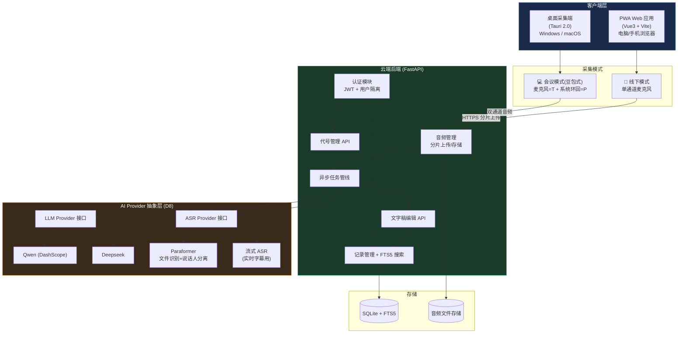
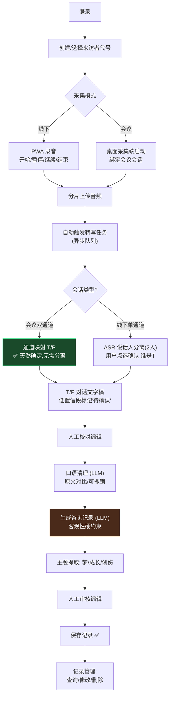
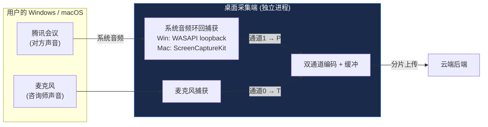
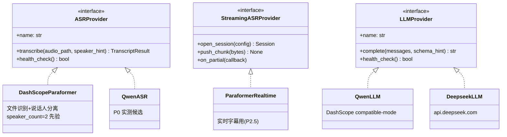
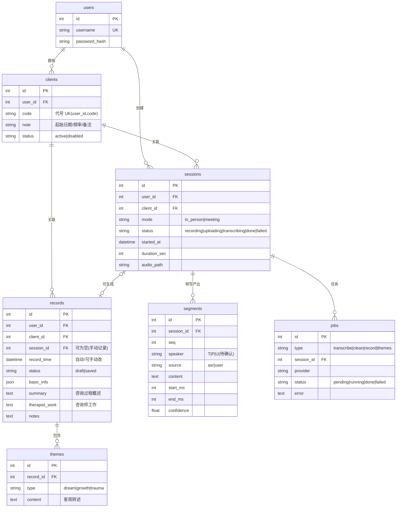
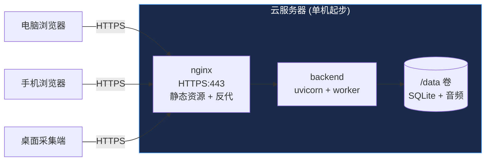
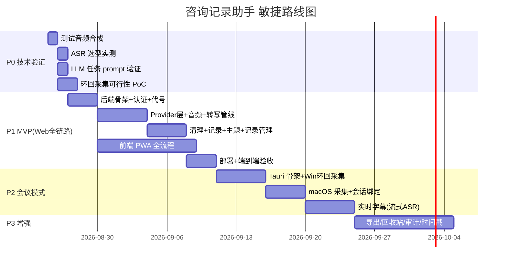

# 「咨询记录助手」整体解决方案 v0.2

> 状态：**规划稿，待陛下确认后进入 P0**
> 上游文档：`萌萌的录音转写小工具-最小化需求.docx`（PRD V1.0）、`00-开发执行契约-v0.1.md`
> 本文档为技术决策权威版本，与契约冲突时以本文档为准。

---

## 1. 产品定位与范围演进

**一句话**：为心理咨询师提供「录音 → T/P 转写 → 口语清理 → 客观合规咨询记录 → 记录管理」的一体化云端 PWA 工具，并通过**独立于会议软件的桌面采集端**支持腾讯会议等在线场景。

**本轮新增需求（陛下补充，已纳入）：**

| # | 决策 | 选择 | 影响 |
|---|------|------|------|
| D7 | 会议采集模式 | 听转能力**独立于会议软件**（豆包模式）：腾讯会议开会中可实时获取语音输入 | 新增桌面采集端组件 + 双通道录音架构 |
| D8 | LLM 架构 | **可配置 Provider 抽象层**（Qwen / Deepseek 均可，配置切换，后期可扩展本地引擎） | 后端强制抽象层设计 |

**关键洞察（D7 带来的架构红利）**：在线会议场景下，采集端可以**双通道录音**——
- 麦克风通道 = 咨询师本人声音 → **天然就是 T**
- 系统环回通道 = 腾讯会议里对方的声音 → **天然就是 P**

**双通道 = 免费的说话人分离**，在线场景无需任何聚类算法，T/P 标注 100% 正确。线下单麦克风场景才需要 ASR 说话人分离。

---

## 2. 系统架构总览



**分层职责：**

| 层 | 组件 | 职责 | 技术选型 |
|----|------|------|----------|
| 客户端 | PWA | 线下录音、全流程操作界面 | Vue3 + Vite + Pinia，响应式 |
| 客户端 | 桌面采集端 | 会议模式双通道采集、独立于会议软件 | Tauri 2.0（Rust 内核，体积小） |
| 后端 | FastAPI | 业务逻辑、任务编排、数据管理 | Python 3.12 + SQLAlchemy + SQLite |
| AI 层 | Provider 抽象 | 统一接口，配置切换厂商 | 接口类 + .env 配置 |
| 存储 | SQLite | 结构化数据 + 全文搜索 | FTS5（1000条搜索<1s 轻松达标） |

---

## 3. 核心业务流程

### 3.1 端到端主流程



### 3.2 会议模式采集细节（豆包式）



**技术方案对比（为什么选 A）：**

| 方案 | 原理 | 优点 | 缺点 | 结论 |
|------|------|------|------|------|
| **A. 桌面端系统 API** | WASAPI(Windows) / ScreenCaptureKit(macOS) 环回捕获 | 免装驱动、稳定、豆包同款能力 | 需开发维护桌面端 | ✅ **选定** |
| B. 虚拟声卡 | BlackHole/VB-Cable 手动路由 | 零开发 | 用户安装配置成本高、易出错 | ❌ |
| C. 浏览器 getDisplayMedia | 共享标签页获取音频 | 纯 Web | macOS 只能抓 Chrome 标签页音频、依赖腾讯会议网页版 | ⚠️ 仅作补充 |

---

## 4. AI Provider 抽象层设计（D8）



**配置方式**（`.env` + 管理界面可切换）：

```ini
ASR_PROVIDER=paraformer        # paraformer | qwen-asr
LLM_PROVIDER=qwen              # qwen | deepseek
LLM_MODEL=qwen-plus            # 各 provider 下的具体模型
DASHSCOPE_API_KEY=***
DEEPSEEK_API_KEY=***
```

**每个 LLM 任务的 prompt 模板独立版本化管理**：`app/backend/prompts/{clean,record,themes}/v1.md`，模板可迭代可回滚。

---

## 5. 数据模型（核心表）



**搜索**：对 `segments.content` 与 `records` 正文建 FTS5 虚拟表，按代号/日期范围/关键词组合过滤。

---

## 6. 关键技术方案

### 6.1 说话人分离（两条路径）

| 场景 | 方案 | 置信度 |
|------|------|--------|
| 会议模式 | 双通道物理分离（mic=T, loopback=P） | 100% |
| 线下模式 | Paraformer 说话人分离（指定 2 人）→ 前端展示首段让用户点选"谁是T" → 全篇映射；低置信段标"待确认"可手动改 | 高（2人封闭场景大幅降低难度） |

### 6.2 三个 LLM 任务的设计要点

| 任务 | 输入 | 输出 | 关键约束 |
|------|------|------|----------|
| 口语清理 | 分段原文（逐段处理防漂移） | 逐段清理后文本 | 保原意保情感；不删实质内容；不新增信息 |
| 记录生成 | 清理后全文 | JSON：概述 + 咨询师工作 | 客观性硬约束：禁诊断、禁推测、只用"来访者自述…"句式 |
| 主题提取 | 清理后全文 | JSON：梦[] / 成长[] / 创伤[]（无则空） | 客观转述不分析；附来源段落引用便于核对 |

所有任务：失败保留输入可重试；输出结构化 JSON 校验失败自动重试一次；记录所用 provider+model+prompt 版本号（可追溯）。

### 6.3 录音可靠性

- **分片上传**：每 10 秒一片，断点续传（已传片记录在 IndexedDB + 服务端）
- **意外中断**：已上传片不丢；页面刷新后恢复会话
- **180 分钟支持**：m4a/opus 编码约 100-200MB，分片机制下无内存压力

### 6.4 安全与合规基线

- TLS（HTTPS 强制，麦克风权限前提）+ JWT + bcrypt
- 音频文件随机路径 + 签名 URL 访问，不暴露可枚举路径
- 所有查询强制 user_id 过滤（数据隔离）
- API Key 仅存 `.env`，不进 git、不打日志
- 创伤内容默认折叠（前端强制）
- 界面明示"AI 生成内容仅供专业参考"
- ⚠️ 已知风险（陛下决策 D6）：知情同意流程推迟，已记录，建议 P2 补上

---

## 7. 部署架构



- `docker-compose` 一键部署（nginx + backend 两个容器）
- P1 部署在现有服务器验证；架构可直接平移阿里云（后期可用 qianwenai-deploy 技能）
- 备份：`.db` 每日自动备份 + 音频目录同步（脚本化）

---

## 8. 敏捷阶段规划



| 阶段 | 交付物 | 验收标准 | 预估 |
|------|--------|----------|------|
| **P0 技术验证** | 选型报告（ASR 实测数据 + LLM prompt 原型 + 环回采集 PoC） | 报告经陛下确认，选型钉死 | 1-2 天 |
| **P1 MVP** | Web 全链路可用（FR-01~07 云端版） | 手机+电脑端到端演示通过 | 2-3 周 |
| **P2 会议模式** | 桌面采集端（Win 优先）+ 双通道转写 + 实时字幕 | 腾讯会议实测采集转写成功 | 2-3 周 |
| **P3 增强** | 导出/回收站/审计日志/时间戳跳转/模板 | 按需求逐条 | 迭代 |
| **P4 扩展** | 本地部署模式、方言、协作 | — | 远期 |

> **滚动细化原则**：任务书对 P0/P1/P2 详细展开，P3/P4 仅列条目——进入该阶段前再细化（敏捷滚动波次规划）。

---

## 9. 风险登记册

| # | 风险 | 影响 | 缓解 |
|---|------|------|------|
| R1 | ASR 说话人分离效果不达标（线下场景） | 转写体验差 | P0 实测先行；兜底：用户手动切换标签的产品设计已在 PRD |
| R2 | macOS 环回采集兼容性（ScreenCaptureKit 需 macOS 13+） | Mac 用户无法用会议模式 | P0 PoC 验证；低版本提示安装 BlackHole 备选方案 |
| R3 | 长音频转写 API 成本/配额 | 费用超预期 | P0 测算 180 分钟音频的 API 费用；设置单用户配额 |
| R4 | LLM 口语清理误删实质内容 | 用户信任受损 | 逐段处理+对比视图+可撤销三重保险；验收用黄金测试集 |
| R5 | 知情同意缺失的合规风险 | 法律风险 | 已记录（D6）；建议 P2 前补最小实现（录音前勾选） |
| R6 | 腾讯会议自带免费转写 | 竞争差异被质疑 | 差异化定位：咨询专业化（T/P 角色、合规记录、主题提取、档案库），不是通用转写 |
| R7 | Reasonix 单任务质量波动 | 返工 | 任务书自包含 + 验收门禁 + 大统领 diff 审查（见工作流文档） |

---

## 10. 开放问题（需陛下后续拍板，不阻塞 P0）

1. **桌面端平台优先级**：建议 Windows 先行（WASAPI 最成熟免驱动），macOS 紧随。是否同意？
2. **macOS 最低版本要求**：ScreenCaptureKit 需 macOS 13+，更低版本是否支持（装虚拟声卡）？
3. **实时字幕的优先级**：会议中实时显示文字（豆包式）放在 P2.5，还是会议采集就要带？（建议采集先行，实时字幕紧随）
4. **云端部署目标**：P1 先部署在现有服务器验证，正式对外时是否用阿里云（可用 qianwenai-deploy 技能一键部署）？
5. **产品命名**：暂称"咨询记录助手"，需要正式名称吗？
