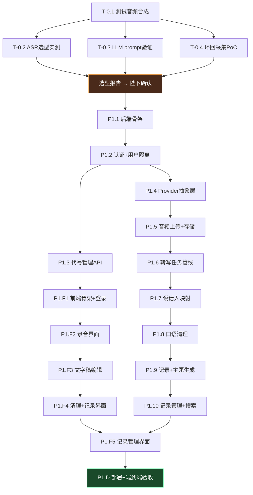
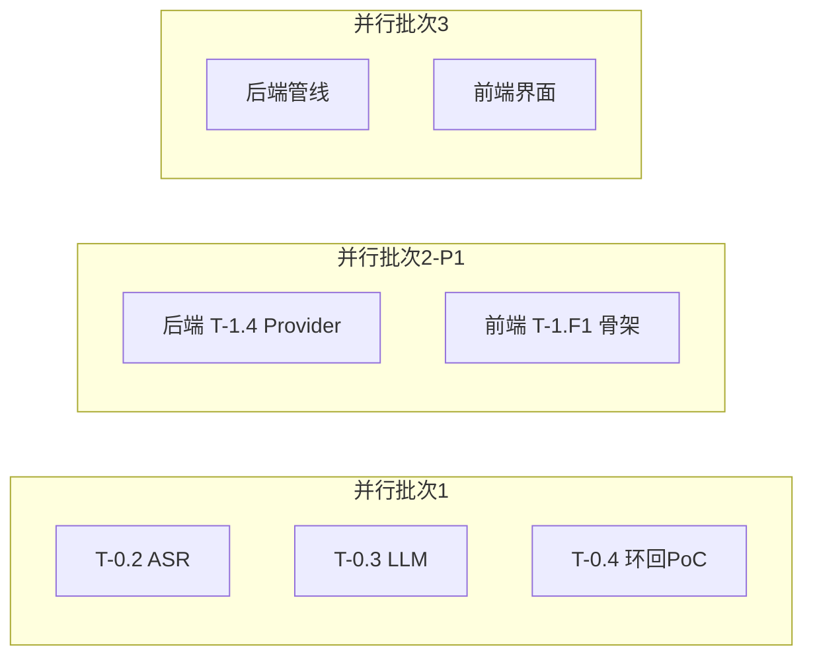

# 「咨询记录助手」任务书与分解 (Task Book)

> 状态：**规划稿，待确认**
> 执行方：Reasonix（编码） / Hermes 大统领（编排+验收）
> 粒度约定：每个任务 = 一次 Reasonix 会话可完成的自包含单元，含明确输入/输出/验收点。

---

## 0. 任务书使用说明

- **依赖关系**见各阶段拓扑图；无依赖任务可并行（用独立 git worktree 避免冲突）。
- 每个任务标注：`[前置]` `[输入]` `[产出]` `[验收]` `[复杂度]`。
- 复杂度：S（<1h）/ M（1-4h）/ L（>4h，建议再拆）。
- Reasonix 每完成一个任务，大统领执行**三重门禁**：编译/类型检查 → 单测/冒烟 → 人工 diff 审查，通过才合入。

---

## 阶段拓扑总览

---

## P0 · 技术验证（spike，由大统领主导，部分可用 Reasonix）

### T-0.1 测试音频合成
- [前置] 无
- [输入] DashScope API Key（已配）；设计 3 类场景脚本：正常对话 / 有打断重叠 / 长停顿
- [产出] `tests/audio/` 下 ≥5 段合成音频（双音色模拟 T+P）+ 对应黄金文字稿 `tests/golden/*.json`
- [验收] 每段音频有标注好的 T/P 段落基准；音频可被 ASR 正常识别
- [复杂度] M
- [工具] qianwen-audio-tts 技能

### T-0.2 ASR 选型实测
- [前置] T-0.1
- [输入] T-0.1 音频；候选：Paraformer 文件识别（含说话人分离）+ Qwen-ASR 系列
- [产出] `docs/adr/001-asr-selection.md`：各候选的字错率、说话人分离准确率、延迟、单小时费用、180分钟长音频支持情况
- [验收] 有真实调用日志与数据支撑，给出明确推荐项
- [复杂度] M
- [门禁] 防幻觉——所有数字必须来自真实 API 返回

### T-0.3 LLM 任务 prompt 原型验证
- [前置] T-0.1
- [输入] 黄金文字稿；3 个任务模板草稿（清理/记录生成/主题提取）
- [产出] `app/backend/prompts/{clean,record,themes}/v1.md` + 各任务在 Qwen 与 Deepseek 上的实测对比记录
- [验收] 清理后语义一致（人工抽查）；记录生成无诊断性语言（用诱导性测试样本验证）；主题提取能正确识别梦/成长/创伤且未涉及输出"无"
- [复杂度] L（可拆 3 个子任务并行）

### T-0.4 会议环回采集 PoC
- [前置] 无（与 0.2/0.3 并行）
- [输入] 方案文档 §3.2
- [产出] 最小 PoC：Windows WASAPI loopback 捕获 + 麦克风双通道混音为单文件；记录 macOS ScreenCaptureKit 可行性结论
- [验收] 在播放一段测试音频（模拟腾讯会议声音）时，能同时录到麦克风+环回两路且可区分
- [复杂度] M
- [备注] 若本机为 Linux 无 Windows，此任务标记为"需 Windows 环境"，先出技术调研结论

---

## P1 · MVP 后端任务

### T-1.1 后端骨架
- [前置] 选型报告确认
- [输入] 技术栈：FastAPI + SQLAlchemy + SQLite；目录结构 `app/backend/{routers,services,providers,models,prompts,core}`
- [产出] 可启动的空骨架：健康检查接口、统一响应封装、异常处理、日志、配置加载（.env）
- [验收] `uvicorn` 启动；`/health` 返回 200；pytest 骨架测试通过
- [复杂度] S

### T-1.2 认证与用户隔离
- [前置] T-1.1
- [产出] 用户注册/登录（bcrypt + JWT）、中间件强制注入 user_id、依赖项 `get_current_user`
- [验收] 未认证请求 401；不同用户数据互不可见（单测覆盖）
- [复杂度] M

### T-1.3 代号管理 API（FR-01）
- [前置] T-1.2
- [产出] 代号 CRUD：新增/编辑/停用/删除；UK(user_id, code)；删除有记录的代号→拒绝仅可停用
- [验收] PRD 4.1 验收标准逐条通过
- [复杂度] S

### T-1.4 Provider 抽象层（D8 核心）
- [前置] T-1.1
- [产出] `ASRProvider` / `LLMProvider` 接口 + DashScope(Qwen) 与 Deepseek 两个 LLM 实现 + Paraformer ASR 实现；`.env` 配置切换；工厂方法按配置实例化
- [验收] 切换 `LLM_PROVIDER=qwen/deepseek` 均可完成一次完整调用；接口单测通过
- [复杂度] M
- [备注] 这是架构基石，大统领重点审查

### T-1.5 音频上传与存储（FR-02）
- [前置] T-1.2
- [产出] 分片上传接口（init/chunk/complete）、断点续传、随机路径+签名URL、会话状态机（recording→uploading→transcribing→done/failed）
- [验收] 180 分钟音频分片上传成功；中断后续传不丢片
- [复杂度] M

### T-1.6 转写任务管线（FR-03）
- [前置] T-1.4, T-1.5
- [产出] 异步任务队列（转写/清理/记录/主题）；转写完成后落库 segments；失败重试与错误提示
- [验收] 上传完成自动触发转写；结果按段落入库；失败有明确错误
- [复杂度] L

### T-1.7 说话人映射（FR-03 线下）
- [前置] T-1.6
- [产出] 线下场景：ASR 返回 2 说话人 → 前端点选映射 → 全篇映射；低置信段标 `U(待确认)`；手动切换标签接口
- [验收] 用户点选一次后全篇正确映射；可手动改任意段标签
- [复杂度] M

### T-1.8 口语清理（FR-04）
- [前置] T-1.6, T-0.3 prompt
- [产出] 逐段清理接口；保留原文版本；对比数据接口；撤销/重做（版本栈）
- [验收] 清理后填充词显著减少且语义一致；可撤销恢复原文
- [复杂度] M

### T-1.9 记录生成 + 主题提取（FR-05/06）
- [前置] T-1.8
- [产出] 记录生成接口（客观性约束在 prompt 层）；主题提取（梦/成长/创伤）；生成失败保留文字稿可重试
- [验收] 输出结构化记录；诱导性样本不产生诊断语言；创伤字段可标记敏感
- [复杂度] M

### T-1.10 记录管理 + 搜索（FR-07）
- [前置] T-1.9
- [产出] 记录 CRUD、删除二次确认、状态（草稿/已保存）、时间自动/手动、FTS5 全文搜索（代号/日期/关键词）
- [验收] 1000 条数据关键词搜索 <1s（造数据压测）
- [复杂度] M

---

## P1 · MVP 前端任务

### T-1.F1 前端骨架 + 登录
- [产出] Vue3+Vite+Pinia 项目、路由、登录/注册页、API 封装、axios 拦截器（JWT）
- [验收] 登录后可进入主页；响应式布局（手机/电脑）

### T-1.F2 录音界面（FR-02）
- [前置] F1
- [产出] MediaRecorder 录音（开始/暂停/继续/结束）、状态/时长/音量展示、分片上传、麦克风权限提示、IndexedDB 断点暂存
- [验收] 电脑+手机浏览器均可录音；刷新不丢已录

### T-1.F3 文字稿编辑（FR-03）
- [前置] F2
- [产出] T/P 对话渲染、段落编辑/合并/拆分/切换标签、待确认高亮、说话人映射点选
- [验收] 所有编辑操作生效且持久化

### T-1.F4 清理 + 记录界面（FR-04/05/06）
- [前置] F3
- [产出] 清理触发+原文对比视图+撤销；记录生成+结构化展示+编辑；主题三区（创伤默认折叠）；"AI 仅供参考"提示
- [验收] 全流程可走通；创伤内容默认折叠

### T-1.F5 记录管理界面（FR-07）
- [前置] F4
- [产出] 记录列表、搜索筛选（代号/日期/关键词）、新增空白记录、删除二次确认
- [验收] 查询结果正确且快速

### T-1.D 部署 + 端到端验收
- [前置] 全部后端+前端任务
- [产出] docker-compose（nginx+backend）、HTTPS 配置、备份脚本、端到端演示脚本
- [验收] 手机+电脑浏览器完整走通 录音→转写→清理→记录→保存→查询

---

## P2 · 会议模式任务（桌面采集端）

### T-2.1 Tauri 骨架 + Windows 环回采集
- [前置] P0.4 PoC 通过
- [产出] Tauri 2.0 应用；WASAPI loopback + 麦克风双通道采集；本地编码缓冲
- [验收] Windows 上能同时采到两路音频

### T-2.2 macOS 采集 + 会话绑定
- [前置] T-2.1
- [产出] ScreenCaptureKit 采集；采集端与后端会话绑定（标记 mode=meeting，通道→T/P 映射）
- [验收] macOS 13+ 采集成功；后端正确识别双通道角色

### T-2.3 实时字幕（流式 ASR）
- [前置] T-2.2
- [产出] StreamingASRProvider + WebSocket 推流；会议中实时显示转写文字
- [验收] 会议中延迟 <2s 显示字幕
- [备注] 优先级待陛下确认（开放问题 #3）

---

## P3 · 增强（条目，进入前再细化）

- 导出 PDF/Word/TXT
- 回收站（30 天自动清除）
- 操作审计日志
- 对比视图优化、时间戳与音频联动
- 自定义咨询记录模板
- 备份恢复界面化

## P4 · 扩展（远期）

- 本地部署模式（含可选本地转写/本地 LLM）
- 多语言/方言
- 多人协作/机构管理
- 第三方系统对接、数据统计

---

## 并行策略建议

- P0 三个实测任务可并行（独立产出）。
- P1 后端 Provider 层与前端骨架可并行（不同 worktree）。
- 后端与前端在接口契约（OpenAPI）冻结后可并行推进。
