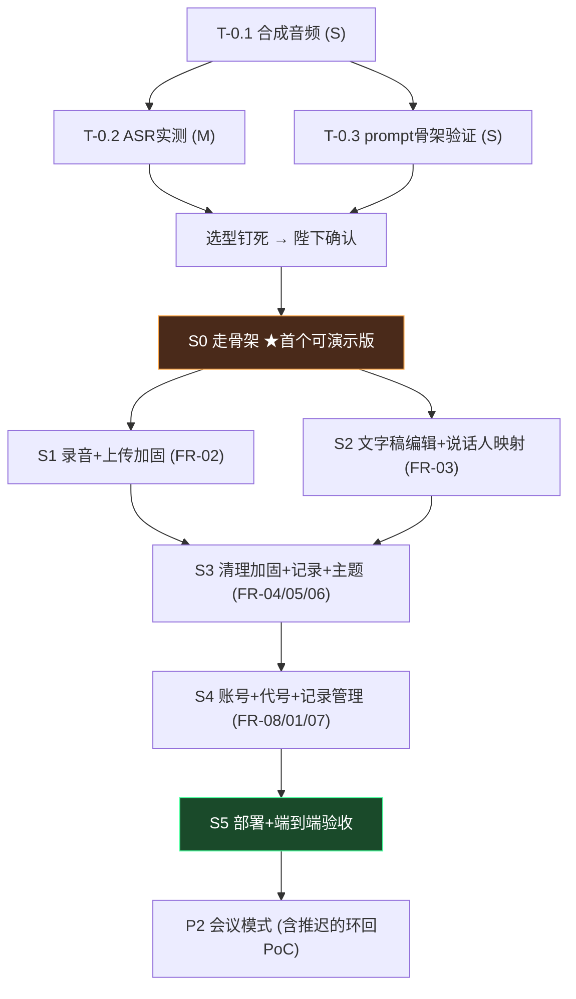

# 「咨询记录助手」任务书 (Task Book) v0.2

> 状态：**修订稿，待确认**（v0.2 按敏捷目标重构：走骨架 + 垂直增量）
> 执行方：Reasonix（编码） / Hermes 大统领（编排+验收） / 陛下（方向+验收演示）
> 核心原则：**先用最短路径做出可演示的最小系统，再按垂直增量逐段长功能**。每个增量 = 一个可演示构建 + 一个 git tag。

---

## 0. 使用说明

- **增量（S）是交付单位**：每个增量 2-3 天，以向陛下演示收尾；任务（T）是增量内的执行单位，每个任务 = 一次 Reasonix 会话可完成的自包含单元。
- 每个任务标注：`[前置] [输入] [产出] [验收] [复杂度] [模型]`。
- 复杂度：S（<1h）/ M（1-4h）/ L（>4h，必须再拆）。
- **模型图例**（Reasonix 四模型阵容，详见工作流 §5）：
  `k3` = kimi/k3（架构/复杂管线）· `kfc` = kimi/kimi-for-coding（专业编码）· `dsp` = deepseek-pro（默认推理）· `mimo` = mimo-v2.5-pro（批量/模板化）· `hs` = kimi-for-coding-highspeed（快活小任务）
- 门禁与证据标准见 `02-工作流.md`：每条验收项报 `PASS / FAIL / NOT RUN`，未验证不得报完成。
- 任务书 = 活动 TODO 台账；完成的增量记入 `docs/progress/` 与 git tag；发现的新工作记入对应增量或 `docs/adr/`，不散落。

### v0.1 → v0.2 变更摘要

1. **P0 压缩到 0.5-1 天**：环回采集 PoC（原 T-0.4）推迟到 P2 开头——它不阻塞最小系统；LLM prompt 验证只验「清理+记录生成」两个骨架，主题提取随 S3 增量补验。
2. **P1 由"大爆炸 MVP"改为 6 个增量 S0-S5**：S0 走骨架（最薄端到端主链路）先行，其后每个增量垂直加厚一段功能，**每个增量结束都可演示**。
3. **每个任务给出推荐模型**，发挥 K3/kfc/mimo 阵容的成本与能力梯度。
4. **修正仓库路径**：旧文档误写 `/home/houmo/meng/proj`，实际为 `/home/houmo/meng/MengPsyAssit`。
5. 门禁升级为风险比例制 + 证据制（详见工作流 §6）。

---

## 阶段拓扑总览



---

## P0 · 技术验证（压缩版，0.5-1 天，大统领主导）

### T-0.1 测试音频合成
- [前置] 无
- [输入] DashScope API Key（已配）；3 类场景脚本：正常对话 / 打断重叠 / 长停顿
- [产出] `tests/audio/` 下 3 段合成音频（双音色模拟 T+P）+ 黄金文字稿 `tests/golden/*.json`
- [验收] 每段有 T/P 段落基准标注；音频可被 ASR 正常识别
- [复杂度] S（v0.1 为 5 段，压缩为 3 段，够选型用）
- [模型] 大统领直接用 qianwen-audio-tts 技能
- [隐私红线] 只用合成音频，不接触真实咨询数据

### T-0.2 ASR 选型实测（P0 唯一硬门禁）
- [前置] T-0.1
- [输入] T-0.1 音频；候选：Paraformer 录音文件识别（含说话人分离）+ Qwen-ASR 系列
- [产出] `docs/adr/001-asr-selection.md`：字错率、说话人分离准确率、延迟、单小时费用、180 分钟长音频支持
- [验收] 所有数字来自真实 API 返回（防幻觉门禁）；给出明确推荐项
- [复杂度] M
- [模型] 大统领主导，脚本杂活可派 `mimo`

### T-0.3 LLM prompt 骨架验证（压缩版）
- [前置] T-0.1
- [输入] 黄金文字稿；「清理」「记录生成」2 个任务模板草稿
- [产出] `app/backend/prompts/{clean,record}/v1.md` + Qwen 实测记录
- [验收] 清理后语义一致（人工抽查）；记录生成在诱导性样本上不产生诊断性语言
- [复杂度] S
- [备注] 主题提取（第 3 个模板）推迟到 S3 增量内验证，不阻塞骨架

---

## P1 · 最小系统（6 个增量，每个可演示）

### S0 · 走骨架（目标：选型确认后 2 天，首个可演示版）

**增量定义**：最薄的端到端主链路——上传音频文件 → 转写成 T/P 对话稿 → 最简清理 → 最简记录生成 → 单页展示。
**故意不做**（留给后续增量，禁止镀金）：录音（用文件上传代替）、分片/断点续传、段落编辑、说话人点选映射、登录注册、版本撤销、搜索、主题提取、移动端打磨。

#### T-S0.1 治理基线 + 后端骨架
- [前置] 选型确认
- [产出] AGENTS.md（仓库工作规则）、.gitignore、FastAPI 骨架（健康检查/统一响应/异常/日志/.env 配置）、pytest+ruff 基线；**数据模型从第一天带 user_id 列**（dev 单用户模式，不做登录）
- [验收] `uvicorn` 启动；`/health` 200；pytest 骨架测试过
- [复杂度] S · [模型] dsp

#### T-S0.2 Provider 接口 + 单一实现
- [前置] T-S0.1
- [产出] `ASRProvider` / `LLMProvider` 抽象接口（D8 架构基石，接口一次定型）+ 仅实现 P0 选定的 ASR + Qwen 一个 LLM；`.env` 配置
- [验收] 接口可一次完整调用；第二个实现留到 S3/S4 需要时再加（抽象只在此处定型，不提前做多实现）
- [复杂度] M · [模型] **k3**（架构基石，重点审查）

#### T-S0.3 最简主链路 API
- [前置] T-S0.2
- [产出] 单文件整体上传（≤200MB）→ 后台转写 → segments 落库 → 最简清理（T-0.3 prompt 直连）→ 最简记录生成 → 查询返回；会话状态机最小版（uploading→transcribing→done/failed）
- [验收] curl 走完上传→转写→清理→记录全链路；失败有明确错误
- [复杂度] M · [模型] dsp

#### T-S0.4 单页前端
- [前置] T-S0.3
- [产出] Vue3+Vite 最小工程（暂不引入 Pinia/路由，单页直写）：选文件上传 → 进度 → T/P 着色对话稿 → 清理后文本 → 记录卡片；"AI 仅供参考"提示
- [验收] 浏览器走通一遍；手机浏览器打开不炸（基础响应式）
- [复杂度] M · [模型] kfc

#### T-S0.5 端到端冒烟 + 演示
- [前置] T-S0.4
- [产出] 用合成音频跑全链路的冒烟脚本 + 演示说明
- [验收] 一段合成音频端到端成功，向陛下演示
- [复杂度] S · [模型] mimo
- [增量出口] 打 tag `v0.1-skeleton`；演示通过才进 S1

---

### S1 · 录音 + 上传加固（FR-02 完整，2-3 天）

#### T-S1.1 MediaRecorder 录音组件
- [产出] 开始/暂停/继续/结束；状态+时长+音量展示；麦克风未授权明确提示
- [验收] 电脑+手机浏览器均可录音 · [复杂度] M · [模型] kfc

#### T-S1.2 分片上传 + 断点续传
- [产出] init/chunk/complete 接口；随机路径+签名URL；会话状态机完整版
- [验收] 180 分钟音频分片上传成功；中断后续传不丢片 · [复杂度] M · [模型] dsp

#### T-S1.3 IndexedDB 断点暂存
- [产出] 录音中刷新/断网后已录音频可恢复
- [验收] 刷新不丢已录 · [复杂度] S · [模型] kfc
- [增量出口] tag `v0.2-recording`；双端录一段→自动转写成功

### S2 · 文字稿编辑 + 说话人映射（FR-03 完整，2-3 天，可与 S1 并行）

#### T-S2.1 对话稿渲染与编辑
- [产出] T/P 对话渲染；段落编辑/合并/拆分/切换标签，全部持久化
- [验收] 所有编辑操作生效且入库 · [复杂度] M · [模型] kfc

#### T-S2.2 说话人映射
- [产出] ASR 双说话人 → 前端点选一次映射全篇；低置信段标 `待确认` 高亮；任意段手动切换标签接口
- [验收] 点选一次全篇正确映射；可手动改任意段 · [复杂度] M · [模型] dsp
- [增量出口] tag `v0.3-editing`

### S3 · 清理加固 + 记录 + 主题（FR-04/05/06 完整，2-3 天）

#### T-S3.1 清理对比视图 + 撤销
- [产出] 原文对比视图；撤销/重做（版本栈）；失败保留原稿可重试
- [验收] 填充词显著减少且语义一致；可撤销恢复原文 · [复杂度] M · [模型] kfc

#### T-S3.2 记录生成加固
- [产出] 客观性硬约束落到 prompt + 校验层；人工审核后才可保存；失败保留文字稿可重试；**接入第二个 LLM 实现（Deepseek），验证 Provider 抽象可切换**
- [验收] `LLM_PROVIDER=qwen/deepseek` 均完成一次生成；诱导性样本不产生诊断语言 · [复杂度] M · [模型] k3

#### T-S3.3 主题提取
- [产出] 梦/成长经历/创伤事件三字段；未涉及显示"无"；创伤默认折叠需主动查看；主题 prompt 随本任务实测验证（补 P0 推迟项）
- [验收] 正确识别三类主题；创伤默认折叠 · [复杂度] M · [模型] dsp
- [增量出口] tag `v0.4-clean-record`

### S4 · 账号 + 代号 + 记录管理（FR-08/01/07，3-4 天）

#### T-S4.1 真实认证
- [产出] 注册/登录（bcrypt+JWT）；中间件强制注入 user_id；`get_current_user` 依赖
- [验收] 未认证 401；不同用户数据互不可见（单测覆盖）· [复杂度] M · [模型] dsp

#### T-S4.2 代号管理 API（FR-01）
- [产出] 代号 CRUD：新增/编辑/停用/删除；UK(user_id, code)；有记录的代号禁删仅可停用；前端代号管理界面
- [验收] PRD 4.1 验收标准逐条通过 · [复杂度] S · [模型] hs

#### T-S4.3 记录 CRUD
- [产出] 记录增删改查；删除二次确认；状态（草稿/已保存）；时间自动/可手动改
- [验收] CRUD 全通；删除有确认 · [复杂度] M · [模型] dsp

#### T-S4.4 全文搜索
- [产出] SQLite FTS5：代号/日期范围/关键词
- [验收] 造 1000 条数据，关键词搜索 <1s · [复杂度] M · [模型] dsp

#### T-S4.5 记录管理界面
- [产出] 登录/注册页 + 记录列表/搜索筛选/新增空白记录
- [验收] 查询结果正确且快速 · [复杂度] M · [模型] kfc
- [增量出口] tag `v0.5-full-app`

### S5 · 部署 + 端到端验收（1-2 天）

#### T-S5.1 部署
- [产出] docker-compose（nginx+backend）、HTTPS、备份脚本
- [验收] `docker-compose up` 一键起 · [复杂度] M · [模型] k3

#### T-S5.2 端到端验收
- [产出] 性能验收（1万字清理<60s、记录生成<120s、1000条搜索<1s、180分钟录音支持）+ 演示脚本
- [验收] 手机+电脑浏览器完整走通 录音→转写→清理→记录→保存→查询；逐条 PASS/FAIL/NOT RUN 报告
- [复杂度] M · [模型] dsp
- [增量出口] tag `v1.0-mvp`；P1 完成，进入 P2

---

## P2 · 会议模式（桌面采集端）

### T-2.0 环回采集 PoC（从 P0 推迟至此）
- [产出] Windows WASAPI loopback + 麦克风双通道混音最小 PoC；macOS ScreenCaptureKit 可行性结论
- [验收] 播放测试音频时能同时录到两路且可区分；若本机无 Windows，先出调研结论
- [复杂度] M · [模型] k3

### T-2.1 Tauri 骨架 + Windows 环回采集
- [前置] T-2.0 通过
- [产出] Tauri 2.0 应用；双通道采集；本地编码缓冲
- [验收] Windows 上同时采到两路音频

### T-2.2 macOS 采集 + 会话绑定
- [产出] ScreenCaptureKit 采集；采集端与后端会话绑定（mode=meeting，通道→T/P 映射）
- [验收] macOS 13+ 采集成功；后端正确识别双通道角色

### T-2.3 实时字幕（流式 ASR）
- [产出] StreamingASRProvider + WebSocket 推流；会议中实时转写
- [验收] 延迟 <2s 显示字幕
- [备注] 优先级待陛下确认（开放问题 #3）

---

## P3 · 增强（条目，进入前再细化）

导出 PDF/Word/TXT · 回收站（30 天）· 操作审计日志 · 对比视图优化与时间戳联动 · 自定义记录模板 · 备份恢复界面化

## P4 · 扩展（远期）

本地部署模式（含可选本地引擎）· 多语言/方言 · 多人协作/机构管理 · 第三方系统对接 · 数据统计

---

## 并行策略

```mermaid
flowchart LR
    subgraph P0并行
        A[T-0.2 ASR]
        B[T-0.3 prompt]
    end
    subgraph S1∥S2
        C[S1 录音+上传]
        D[S2 编辑+映射]
    end
    subgraph S4内并行
        E[后端 S4.1-4.4]
        F[前端 S4.5]
    end
```

- P0 两个实测任务并行。
- **S1 与 S2 可并行**（独立 git worktree；S1 重后端上传+录音组件，S2 重文字稿交互，冲突面小，合入前各过门禁）。
- S4 内后端与前端在接口契约（OpenAPI）冻结后并行。
- 其余增量串行，避免多线并行的验收债务。
