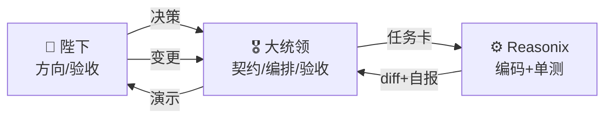
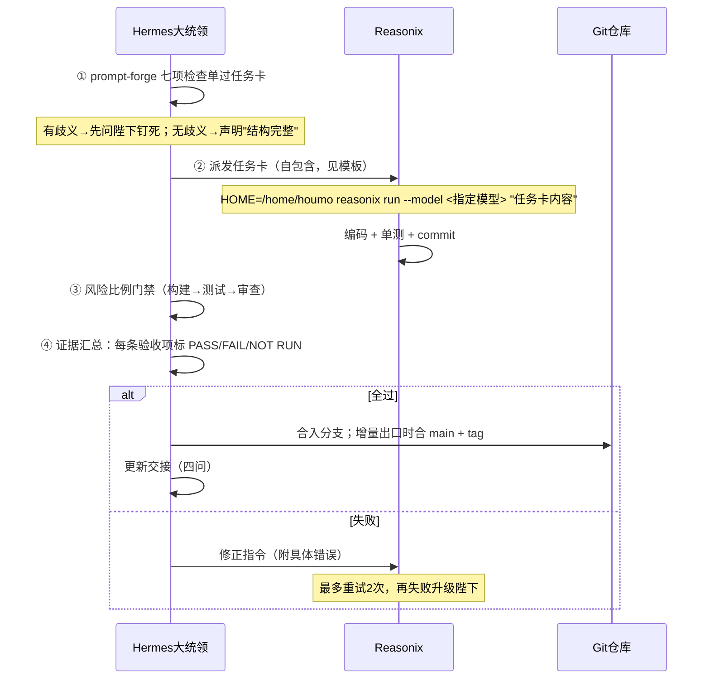
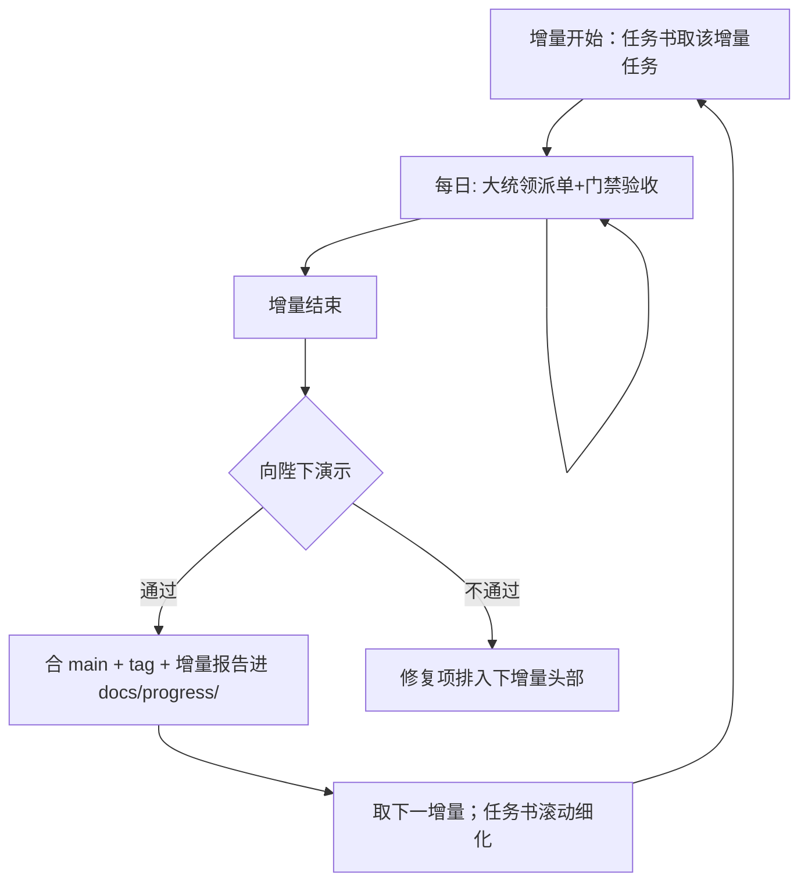

# 「咨询记录助手」开发工作流 v0.2（Hermes × Reasonix 协作规范）

> 状态：**修订稿，待确认**（v0.2 对齐敏捷增量模式 + 新技能 + 新模型阵容）
> 原则：**大统领负责 Plan + 编排 + 验收，Reasonix 负责编码执行，陛下负责方向决策与最终验收。**
> 已安装技能（qqbot 技能库）：`prompt-forge`（任务契约锻造）+ `ai-software-engineering-governance`（执行治理与证据验收）——本工作流是这两个技能在本项目的落地细则。

---

## 1. 角色分工

| 角色 | 职责 | 不做 |
|------|------|------|
| 陛下 | 拍板方向决策、验收每增量演示、提需求变更 | — |
| 大统领 | 锻造任务卡、派单、审 diff、跑验收、维护文档（ADR/进度/交接） | 不亲自写大段业务代码（P0 spike 除外） |
| Reasonix | 按任务卡实现代码+单测、提交 git | 不改需求、不擅自扩范围、不跳过验收项 |



---

## 2. 单任务执行流（含技能门禁）



**① 任务卡锻造（prompt-forge 落地）**：大统领给每张任务卡过七项检查单——目标与成功定义 / 执行者（哪个模型）/ 路线决策已钉死 / 输入与环境事实 / 范围边界（不做什么）/ 输出契约 / 验收标准。任务卡必须自包含（Reasonix 无对话上下文）。

**任务卡模板**：
```
## 任务 <ID>: <标题>
### 背景与契约（从方案/任务书粘贴相关章节，自包含）
### 输入（前置产出、文件路径、接口约定）
### 要求（正面清单 + "不要做什么"反面清单）
### 验收标准（可客观检查，逐条可判 PASS/FAIL）
### 技术约束（目录/命名/依赖/禁止事项）
```

**④ 证据制验收（governance 落地）**：大统领不复述 Reasonix 的自我声明，每条验收项独立跑证据；报告格式：

```
验收 <条目>: PASS | FAIL | NOT RUN
证据: <命令输出/截图路径/日志片段>
环境: <运行环境说明>
```

---

## 3. 风险比例门禁（替代原"三重门禁"硬编码）

门禁强度与变更风险成正比，不为凑数跑无关层；**跳过的层必须说明残余风险**。

| 风险 | 门禁层 | 例 |
|------|--------|----|
| 低（文档/配置/纯前端样式） | 审查门禁即可 | 改 README |
| 中（常规功能代码） | 构建 → 单测/冒烟 → diff 审查 | 一个 API 端点 |
| 高（架构/安全/数据模型/部署） | 全层 + 大统领亲自实测 | Provider 抽象、认证、docker |

门禁工具：

| 层 | 内容 | 工具 |
|----|------|------|
| ① 构建 | 后端导入/启动检查、ruff；前端 build | terminal |
| ② 测试 | 单测全过 + 关键路径冒烟 | pytest / vitest / curl 冒烟脚本 |
| ③ 审查 | diff 人工审：范围不越界、无硬编码密钥、无 TODO 占位、符合方案文档、不混入无关重构 | 大统领 |

**合入规则**：三门全过才合入。失败最多重试 2 次，仍失败 → 升级陛下（换方案 / 拆任务 / 大统领亲自上）。

**诚实条款（governance）**：
- 编译通过 ≠ 功能验收；单测过 ≠ 端到端通过——报告时分层陈述，不混淆。
- 未验证项报 `NOT RUN` 并列验证步骤，绝不标成通过。
- Reasonix 自称"已完成"不作数，一律以实测证据为准。

---

## 4. 仓库与分支规范

```
/home/houmo/meng/MengPsyAssit/     ← git 仓库根（注意：旧文档误写 meng/proj，以此为准）
├── docs/                           方案/任务书/工作流/prd/adr/progress
├── app/{backend,frontend,desktop}/ desktop 在 P2 创建
├── tests/{audio,golden}/           合成音频 + 黄金基准（>5MB 用 git-lfs 或不入库）
└── deploy/
```

- **分支模型**：`main`（只进验收过的代码）+ `task/<ID>-<slug>`（每任务一支）；并行任务用独立 git worktree。
- **增量出口 = tag**：`v0.1-skeleton` → `v0.2-recording` → `v0.3-editing` → `v0.4-clean-record` → `v0.5-full-app` → `v1.0-mvp`，另 `p0-report`、`p2-meeting`。
- **提交消息**：`[T-S0.3] feat: 最简主链路 API (S0)`，前缀必须带任务 ID。
- **敏感红线**：`.env` 永不进 git；测试只用合成音频，不接触真实咨询数据。
- **台账归位**（governance）：稳定工作规则→AGENTS.md；技术取舍→docs/adr/；踩坑→GOTCHAS.md；已验证成果→docs/progress/ 增量报告；跨会话交接→`docs/handoffs/CURRENT.md`。

---

## 5. Reasonix 调用规范（本机已实测验证）

```bash
# 一次性任务（主力模式，任务卡全文作为 prompt；在项目目录内运行）
cd /home/houmo/meng/MengPsyAssit && HOME=/home/houmo \
  reasonix run --model "kimi/k3" "任务卡内容"

# 交互式攻坚（复杂任务需多轮引导时）
cd /home/houmo/meng/MengPsyAssit && HOME=/home/houmo \
  reasonix --model "deepseek-pro/deepseek-v4-pro"
```

**四模型阵容（2026-08-25 配置，均已实测连通）**：

| 代号 | 模型 | 用途 | 备注 |
|------|------|------|------|
| `k3` | kimi/k3 | 架构基石、复杂管线、部署 | 1M 上下文，agentic 最强，Kimi Coding 套餐不计 API 费 |
| `kfc` | kimi/kimi-for-coding | 专业编码（前端组件、编辑交互） | 256K，编码专供 |
| `hs` | kimi/kimi-for-coding-highspeed | 快活小任务 | 256K |
| `dsp` | deepseek-pro/deepseek-v4-pro | 默认：常规后端逻辑 | 1M |
| `mimo` | mimo/mimo-v2.5-pro | 批量/模板化杂活、冒烟脚本 | ¥0.018/任务级成本 |

任务书中每个任务已标注推荐模型；大统领可按实际复杂度微调（向上升级需说明理由）。

**注意事项**：
- 必须带 `HOME=/home/houmo` 前缀（profile 会话中 HOME 指向别处）。
- Reasonix 不会自动汇报——大统领派单后轮询进度、检查产出，不信自报。
- 旧文档中的 `reasonix code <path>` 子命令**不存在**，已更正为 `reasonix run`（一次性）与交互模式。

---

## 6. 敏捷节奏（增量驱动）



- **增量 = 交付单位**：2-3 天一个，每个增量以演示收尾（S0 走骨架起就是可演示系统）。
- **滚动规划**：任务书对当前+下一增量详细展开，其余留骨架条目；进入前再细化。
- **变更管理**：陛下随时可提变更 → 大统领评估影响 → 更新任务书 → 重大取舍记 `docs/adr/`。
- **交接（governance 四问）**：增量收尾及会话压缩前更新 `docs/handoffs/CURRENT.md`，必答：边界变了什么 / 证据是什么 / 什么没验证 / 如何回滚。
- **需求追溯**：任务卡标注对应 FR-xx，验收时反查覆盖度。

---

## 7. 开工前置条件清单

| # | 事项 | 状态 |
|---|------|------|
| 1 | 陛下确认四份文档（方案/任务书 v0.2/工作流 v0.2/执行契约） | ⏳ 待确认 |
| 2 | 回答方案文档 §10 的 5 个开放问题（不阻塞 P0） | ⏳ 待回答 |
| 3 | Reasonix 模型阵容就绪（k3/kfc/hs/dsp/mimo 已实测） | ✅ 完成 2026-08-25 |
| 4 | DashScope Key 供后端使用（从 .env 复制，不共享明文） | ⏳ T-S0.1 时执行 |
| 5 | P0 合成测试音频（qianwen-audio-tts） | ⏳ P0 第一步 |

**确认后第一个动作 = T-0.1 测试音频合成（半天内可见产出）。**
