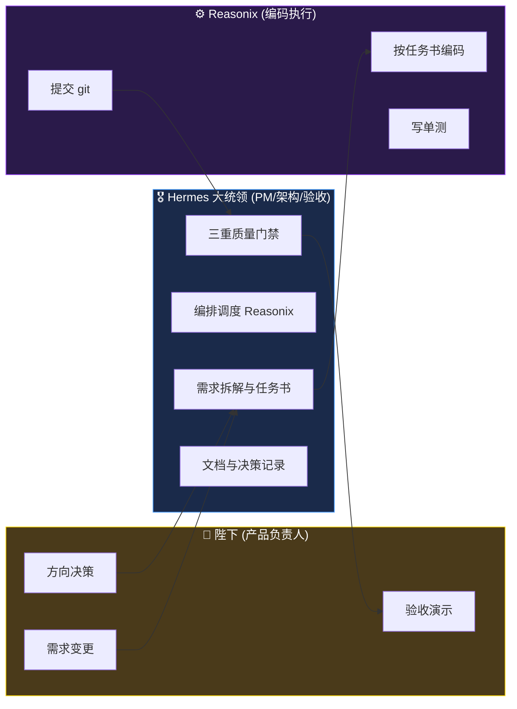
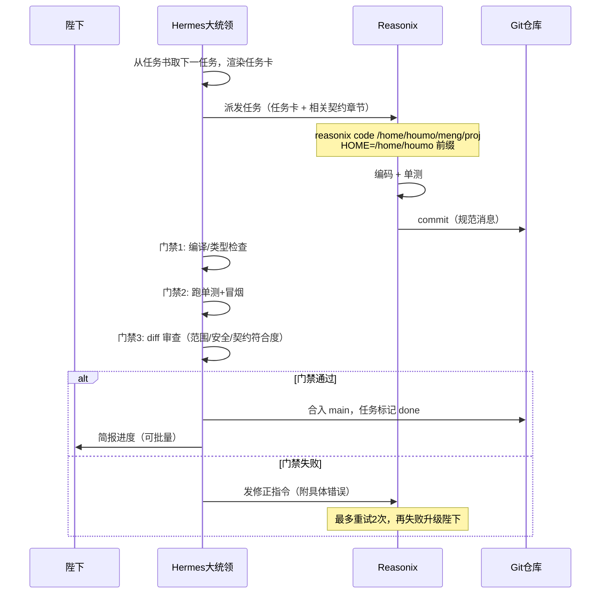
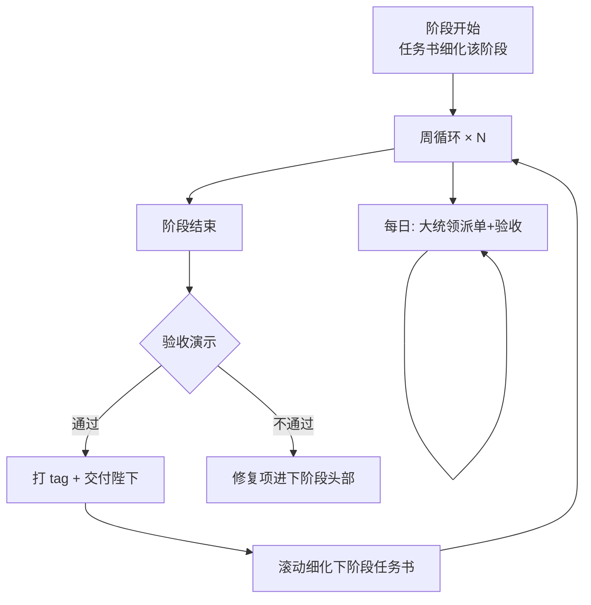

# 「咨询记录助手」开发工作流（Hermes × Reasonix 协作规范）

> 状态：**规划稿，待确认**
> 原则：**大统领负责 Plan + 编排 + 验收，Reasonix 负责编码执行。** 陛下负责方向决策与最终验收。

---

## 1. 角色分工



| 角色 | 职责 | 不做 |
|------|------|------|
| 陛下 | 拍板方向决策、验收每阶段演示、提需求变更 | — |
| 大统领 | 写任务书、派单、审查 diff、跑验收、维护文档（ADR/进度） | 不亲自写大段业务代码（P0 spike 除外） |
| Reasonix | 按任务书实现代码+单测 | 不改需求、不擅自扩范围、不跳过验收项 |

---

## 2. 单任务执行流（标准循环）



**任务卡模板**（每次派单的标准结构）：
```
## 任务 <ID>: <标题>
### 背景与契约
（从任务书/方案文档粘贴相关章节，Reasonix 无对话上下文，必须自包含）
### 输入
（前置任务产出、相关文件路径、接口约定）
### 要求
（逐条产出要求，含"不要做什么"）
### 验收标准
（可客观检查的条目）
### 技术约束
（目录结构、命名、依赖版本、禁止事项）
```

---

## 3. 三重质量门禁

| 门禁 | 内容 | 工具 |
|------|------|------|
| ① 构建门禁 | 编译通过、类型检查（mypy/ruff；前端 tsc/build） | terminal |
| ② 测试门禁 | 单测全过 + 关键路径冒烟测试 | pytest / vitest |
| ③ 审查门禁 | diff 人工审查：范围不越界、无硬编码密钥、无 TODO 占位、符合方案文档 | 大统领 |

**合入规则**：三门全过才合入 main。失败任务最多重试 2 次，仍失败 → 升级陛下决策（换方案 / 拆任务 / 大统领亲自上）。

---

## 4. 仓库与分支规范

```
/home/houmo/meng/proj/           ← git 仓库根
├── docs/
│   ├── 00-整体解决方案.md
│   ├── 01-任务书.md
│   ├── 02-工作流.md              ← 本文档
│   ├── adr/                      ← 架构决策记录（每决策一文件）
│   └── progress/                 ← 阶段进度周报
├── app/
│   ├── backend/                  ← FastAPI
│   ├── frontend/                 ← Vue3 PWA
│   └── desktop/                  ← Tauri（P2 阶段创建）
├── tests/
│   ├── audio/                    ← 合成测试音频
│   └── golden/                   ← 黄金转写基准
└── deploy/
    └── docker-compose.yml
```

- **分支模型**：`main`（只进验收过的代码）+ `task/<ID>-<slug>`（每任务一支）
- **提交消息**：`[T-1.3] feat: 代号管理 API (FR-01)`，前缀必须带任务 ID
- **里程碑打 tag**：`p0-report`、`p1-mvp`、`p2-meeting` ...
- **敏感红线**：`.env` 永不进 git；音频测试文件 >5MB 用 git-lfs 或不入库

---

## 5. Reasonix 调用规范（本机已验证）

```bash
# 交互式项目编码（主力模式，在项目目录内读写文件）
HOME=/home/houmo reasonix code /home/houmo/meng/proj

# 一次性生成（小任务/脚本）
HOME=/home/houmo reasonix run "任务描述"
```

- 当前模型：`deepseek-pro/deepseek-v4-pro`（config.toml）；复杂任务可用，成本极低
- **必须带 `HOME=/home/houmo` 前缀**（profile 会话中 HOME 指向别处，不带会找不到配置）
- 项目目录需为 git 仓库（首次任务前先 `git init`）
- 并行任务用独立 git worktree，避免文件冲突
- Reasonix 不会自动汇报——大统领每次派单后轮询进度、检查产出

---

## 6. 敏捷节奏



- **滚动规划**：只详细规划当前+下一阶段（当前方案已含 P0/P1/P2 详细任务，P3+ 仅条目）
- **变更管理**：陛下随时可提变更 → 大统领评估影响（范围/工期）→ 更新任务书 → 记入 `docs/adr/`
- **进度透明**：每阶段结束出进度周报（`docs/progress/`），含完成任务、验收结果、风险更新
- **需求追溯**：每个任务卡标注对应的 FR-xx / US-xx 编号，验收时可反查覆盖度

---

## 7. 开工前置条件清单（Checklist）

| # | 事项 | 状态 |
|---|------|------|
| 1 | 陛下确认三份文档（方案/任务书/工作流） | ⏳ 待确认 |
| 2 | 回答方案文档 §10 的 5 个开放问题 | ⏳ 待回答 |
| 3 | `/home/houmo/meng/proj` 初始化 git 仓库 | ⏳ 待执行（确认后大统领做） |
| 4 | DashScope Key 供后端项目使用（从 .env 复制，不共享明文） | ⏳ 待执行 |
| 5 | P0 合成测试音频（qianwen-audio-tts） | ⏳ P0 第一步 |

**一切就绪后，第一个动作 = T-0.1 测试音频合成（约 1 小时可见产出）。**
